# Gan's CFOP Remade

* TOC
{:toc}

## F2L

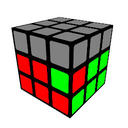
 (RU'U'R'U)2y'(R'U'R)

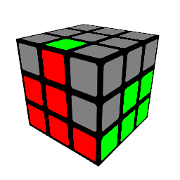
 (URU'R'U')y'(R'UR)

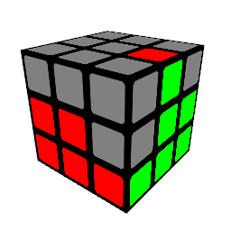
 (R'F'RU)(RU'R'F)

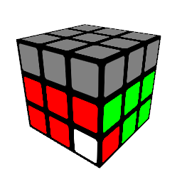
 (RUR'U')(RU'U'R'U')(RUR')

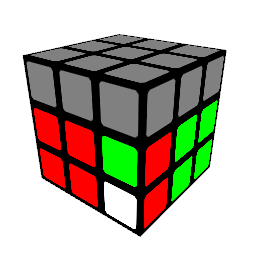
 (RU'RU)y(RU'R'F2)

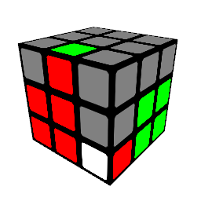
 y'(R'U'RU)(R'U'R)

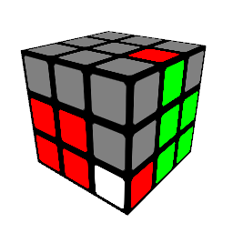
 (RU'R'U)(RU'R')

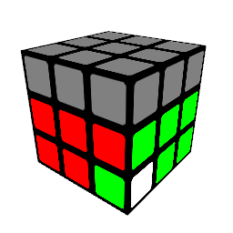
 (RU'R'U)(RU'U'R'U)(RU'R')

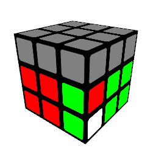
 R2y(RUR'U')y'(R'UR')

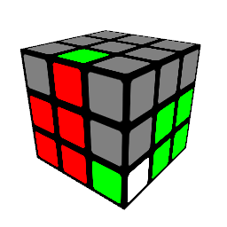
 y'(R'U)(RU')(R'UR)

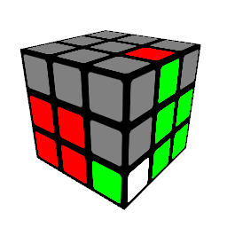
 (RUR'U')(RUR')

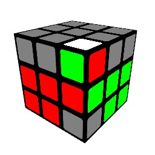
 (RUR'U')2(RUR')

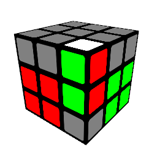
 (RU'R')y'(R'U2R)

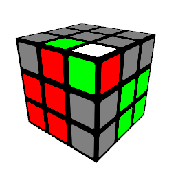
 y'(R'U2)(RUR'U')R

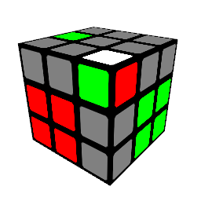
 y'U'(R'U2)(RU'R'U)R

 y'(R'URU'U')(R'U'R)

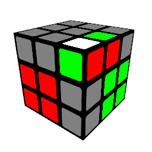
 y'(U2R2'U2)(RUR'UR2)

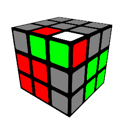
 (RUR')U2(RUR'U')(RUR')

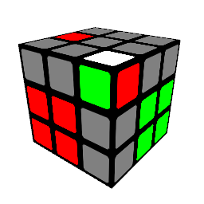
 (RU'R'U2)(RUR')

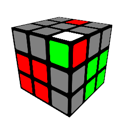
 U(RU'U')(R'URU')R'

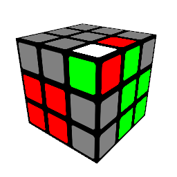
 (RU'U')(R'U'RU)R'

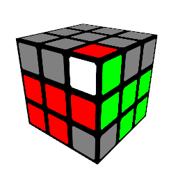
 U'(RU')(R'U2)(RU'R')

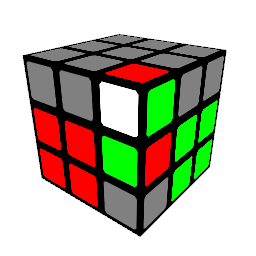
 U'(RUR')d(R'U'R)

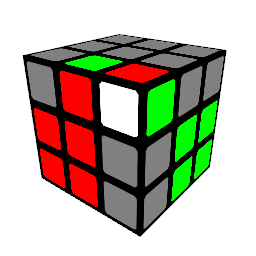
 d(R'URU')(R'U'R)

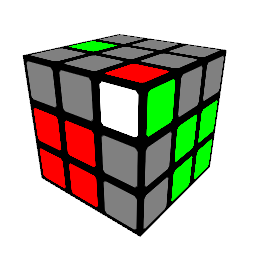
 y'(R'U'R)

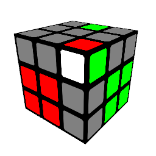
 (dR'U'RU')(R'U'R)

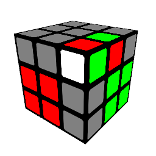
 y'(RU'U')R'2U'R2U'R'

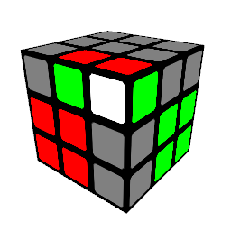
 y'(R'U)(Rd'U')(RUR')

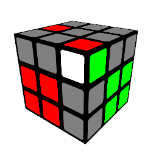
 U'(RU'U')(R'U2)(RU'R')

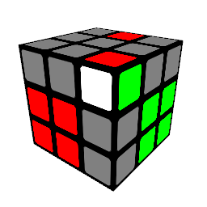
 U'(RUR'U')(RU'U'R')

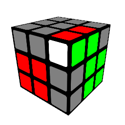
 URU'R'

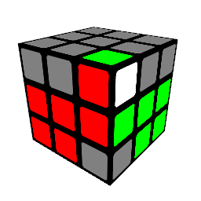
 U'(RU'U'R'U)(RUR')

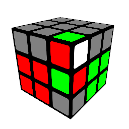
 d(R'U'R)d'(RUR')

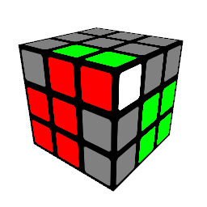
 y'U'(R'UR)

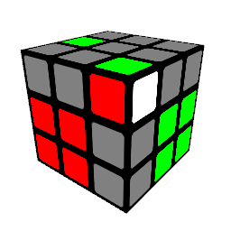
 (dR'U'RU'U')(R'UR)

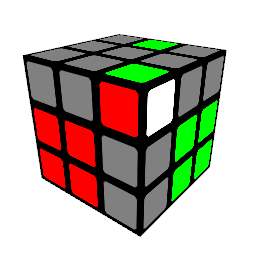
 d(R'U2)(RU'U')(R'UR)

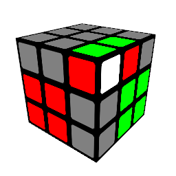
 (RU'R'U)(dR'U'R)

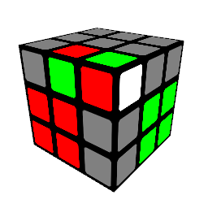
 (R'U2)(R2'U)(R2'UR)

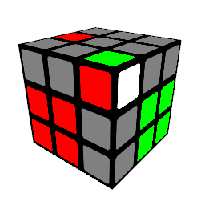
 U'(RUR'U)(RUR')

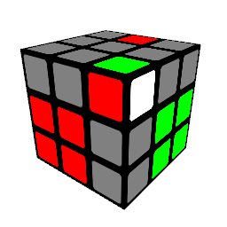
 (RUR')

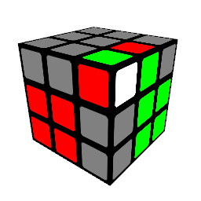
 U'(RU'R'U)(RUR')

## OLL

1
 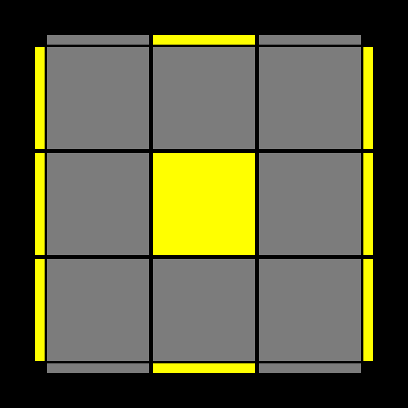
 (RU'U')(R2'FRF')U2(R'FRF')

2
 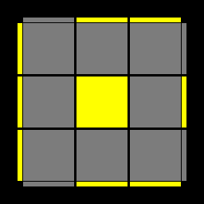
 (FRUR'U'F')(fRUR'U'f')

3
 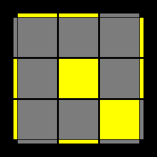
 f(RUR'U')f'U'F(RUR'U')F'

4
 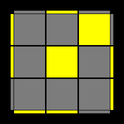
 f(RUR'U')yx(R'F)(RUR'U')F'

5
 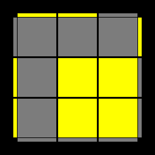
 (r'U2)(RUR'U)r

6
 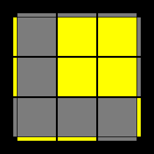
 (rU'U')(R'U'RU'r')

7
 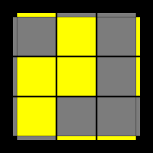
 rUR'URU'U'r'

8
 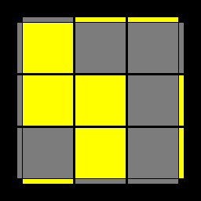
 r'U'RU'R'U2r

9
 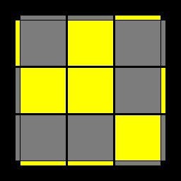
 (R'U'R)y'x'(RU')(R'F)(RUR')

10
 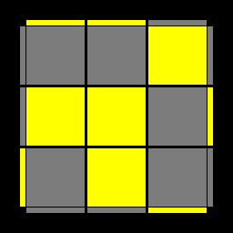
 (RUR'U)(R'FRF')(RU'U'R')

11
 
 r'(R2UR'U)(RU'U'R'U)(rR')

12
 
 (rR'2U'RU')(R'U2RU'R)r'

13
 
 (rU'r'U')(rUr')(F'UF)

14
 
 R'FRUR'F'R(FU'F')

15
 
 (r'U'r)(R'U'RU)(r'Ur)

16
 
 (rUr')(RUR'U')(rU'r')

17
 
 (RUR'U)(R'FRF'U2)R'FRF'

18
 
 F(RUR'd)(R'U2)(R'FRF')

19
 
 R'U2FRUR'U'y'R2U'U'RB

20
 
 r'(RU)(RUR'U'r2)(R2'U)(R U')r'

21
 
 (RU'U')(R'U'RUR'U')(RU'R')

22
 
 RU'U'(R'2U')(R2U')R'2U'U'R

23
 
 (R2D')(RU'U')(R'D)(RU'U'R)

24
 
 x'RUR'z'(RU)(L'U'R')

25
 
 F'(rUR'U')(r'FR)

26
 
 RU'U'R'U'RU'R'

27
 
 RU'U'R'U'RU'R'

28
 
 (rUR'U')(r'RU)(RU'R')

29
 
 (RUR'U')(RU'R'F'U'F)(RUR')

30
 
 (R2UR'B')(RU')(R2'U)(RBR')

31
 
 (r'F'UF)(LF'L'U'r)

32
 
 (RU)(B'U')(R'URBR')

33
 
 (RUR'U')(R'FRF')

34
 
 (R'U'RU)x'z'(RU)(LU')rR'

35
 
 RU'U'R2'FRF'(RU'U'R')

36
 
 R'U'RU'R'URUlU'R'U

37
 
 F(RU'R'U'RU)(R'F')

38
 
 (RUR'U)(RU'R'U')(R'FRF')

39
 
 (rU'r'U'r)y(RUR'f')

40
 
 (R'FRUR'U')(F'UR)

41
 
 RU'R'U2RUyRU'R'U'F'

42
 
 (R'U2)(RUR'UR2)y(RUR'U')F'

43
 
 (B'U')(R'URB)

44
 
 f(RUR'U')f'

45
 
 F(RUR'U')F'

46
 
 (R'U')R'FRF'(UR)

47
 
 B'(R'U'RU)2B

48
 
 F(RUR'U')2F'

49
 
 RB'(R2F)(R2B)R2F'R

50
 
 L'B(L2F')(L2B')L2FL'

51
 
 f(RUR'U')2f'

52
 
 R'U'RU'R'dR'UlU

53
 
 (r'U2)(RUR'U')(RUR'U)r 

54
 
 (rU'U')(R'U'RUR'U')(RU'r')

55
 
 (RU'U')(R'2U')RU'R'U2(FRF')

56
 
 F(RUR'U')(RF')(rUR'U')r'

57
 
 (RUR'U'r)(R'U)(RU'r')

## PLL

1
 
 (RU'R)(URUR)(U'R'U'R2)

2
 
 (R2'U)(RUR'U')(R'U')(R'UR')

3
 
 L2(l'2U)L2(l'2U2)L2(l'2U)L2l2

4
 
 (UR'U')(RU'R)(URU')(R'URU)(R2U')(R'U)

5
 
 x'R2D2(R'U'R)D2(R'UR')

6
 
 x'R2D2(R'U'R)D2(R'UR')

7
 
 x'(RU'R'D)(RUR')u2'(R'UR)D(R'U'R)

8
 
 (RUR'U')(R'F)(R2U'R'U')(RUR'F')

9
 
 U'(R'URU'R'2b')x(R'UR)y'(RUR'U'R2)

10
 
 (R'UR'U')yx2(R'UR'U'R2)xz'(R'U'RUR)

11
 
 F(RU'R'U')(RUR'F')(RUR'U')(R'FRF')

12
 
 z(U'RD')(R2UR'U'R2U)z'(RU')

13
 
 (RUR'F')(RUR'U')(R'FR2U'R'U')

14
 
 ((R'U2)(R U'U')(R'FRUR'U')(R'F'R2 U')

15
 
 (RU'U')(R'U2)(RB'R'U')(RURBR2'U)

16
 
 (R2'u'RU'R)(UR'u)(R2fR'f')

17
 
 (RUR')y'(R2'u'RU')(R'UR'uR2)

18
 
 (R2u)(R'UR'U')(Ru')(R2'F'UF)

19
 
 (R'd'F)(R2u)(R'U)(RU'Ru'R2)

20
 
 z(R'UR')z'(RU2L'UR')z(UR')z'(RU2L'UR')

21
 
 z(U'RD')(R2UR'U')z'(RUR')z(R2UR')z'(RU')

