# OLL/PLL Algorithm Discovering

This C++ program enumerates each of all "optimal-moves" OLL/PLL algorithms that ends with R or R'.
The program uses a Bidirectional BFS algorithm.

## OLL Algorithm Discovering
1. Run [PrepareOLL.exe](PrepareOLL.exe) for forward searching, which generates OLL8.dat.
2. Run [DiscoverOLL.exe](DiscoverOLL.exe) for backward searching, which generates [found_oll.txt](found_oll.txt)

## PLL Algorithm Discovering
1. Run [PreparePLL.exe](PreparePLL.exe) for forward searching, which generates PLL8.dat.
2. Run [DiscoverPLL.exe](DiscoverPLL.exe) for backward searching, which generates [found_pll.txt](found_pll.txt)

The program can be stopped at anytime by pressing "ESC", which will end with an incomplete result file.

## OLL Results

### OLL 1

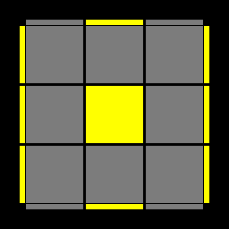

```
F'U'LF'L'FFUFR'F'R
BUL'BLBBU'B'RBR'
```

### OLL 2


```
F'U'FRBULU'L'UB'R'
F'U'FRBUL'BLBBR'
FR'F'RURRB'R'BU'R'
B'RBR'U'RRFRF'UR
BUB'R'F'U'L'ULU'FR
BUB'R'F'U'LF'L'FFR
RBR'ULU'L'RUB'U'R'
R'U'F'UL'RU'LUR'FR
BUB'UR'F'L'U'LU'FR
R'F'RU'L'ULR'U'FUR
F'U'FU'RBLUL'UB'R'
RUBU'LR'UL'U'RB'R'
BLU'FU'F'L'B'UR'UR
BLU'FUF'U'L'B'R'UR
R'U'BFFLFL'B'UFR
BLLF'L'FU'L'B'R'UR
LFUF'U'L'RUBU'B'R'
RBUF'LU'L'UB'FU'R'
RBUF'L'BLBBFU'R'
RUBF'U'LUL'FU'B'R'
R'U'BF'UL'U'LB'UFR
F'LLBLB'ULFRU'R'
R'F'U'BL'ULU'B'FUR
R'F'U'BLF'L'B'FFUR
L'B'U'BULR'U'F'UFR
RUBBF'L'B'LFU'B'R'
F'L'UB'UBLFU'RU'R'
F'L'UB'U'BULFRU'R'
```

### OLL 3


```
R'UFR'F'R'DL'B'LD'R'
BLUL'U'B'R'U'F'UFR
B'U'R'URBRBUB'U'R'
F'U'L'UFR'F'LU'FUR
F'U'L'ULFR'F'U'FUR
FURU'BR'F'RUB'U'R'
FURU'R'F'RBUB'U'R'
BULU'L'B'R'F'U'FUR
R'D'LF'L'DRUFR'F'R
R'D'LF'L'DR'B'R'BUR'
RB'R'BURDL'B'LD'R'
```

### OLL 4


```
RU'B'RBRD'LFL'DR
F'L'U'LUFRUBU'B'R'
B'U'R'URBR'F'U'FUR
B'U'R'UF'RBR'U'FUR
F'U'L'ULFRBUB'U'R'
FURU'R'F'R'F'U'FUR
BULU'B'RBL'UB'U'R'
BULU'L'B'RBUB'U'R'
R'FRF'U'R'D'LFL'DR
RDL'BLD'RFRF'U'R
RDL'BLD'R'U'B'RBR'
```

### OLL 5


```
R'FFLFL'FR
```

### OLL 6


```
RBBL'B'LB'R'
```

### OLL 7

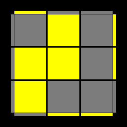

```
RBL'BLBBR'
```

### OLL 8


```
R'F'LF'L'FFR
```

### OLL 9


```
B'U'BRB'R'URBR'
R'F'UL'U'LU'FUR
```

### OLL 10


```
FUF'R'FRU'R'F'R
RBU'LUL'UB'U'R'
```

### OLL 11


```
B'R'U'RUBR'F'U'FUR
RD'BRULU'L'R'B'DR'
F'L'U'LUFRBUB'U'R'
BLUL'B'RDL'B'LD'R'
BLUL'UB'RRFRF'R
RRDL'B'LD'R'BUB'R'
F'UUFURBLUL'B'R'
R'F'UFRRDL'B'LD'R'
RU'LBUFU'B'F'L'UR'
RBL'BL'DLD'LBBR'
RBUB'U'BL'BLBBR'
```

### OLL 12

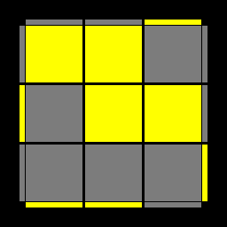

```
FRUR'U'F'RBUB'U'R'
R'DF'R'U'L'ULRFD'R
F'L'U'LFR'D'LFL'DR
F'L'U'LU'FRRB'R'BR'
RRD'LFL'DRF'U'FR
BLUL'U'B'R'F'U'FUR
R'F'U'FUF'LF'L'FFR
R'F'LF'LD'L'DL'FFR
R'UL'F'U'B'UBFLU'R
BUUB'U'R'F'L'U'LFR
RBU'B'RRD'LFL'DR
```

### OLL 13


```
FR'F'U'FRF'R'UR
```

### OLL 14

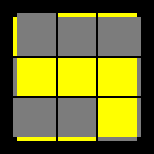

```
B'RBUB'R'BRU'R'
```

### OLL 15


```
BLB'R'BUL'U'B'R
R'F'L'RU'LUR'FR
```

### OLL 16


```
F'L'FRF'U'LUFR'
RBLR'UL'U'RB'R'
```

### OLL 17


```
FR'F'RUURU'BU'B'R'
RU'B'RBLRD'FDL'R
R'UFR'F'L'R'DB'D'LR'
B'RBR'UUR'UF'UFR
R'U'F'LUF'U'L'UFFR
LU'F'LFLRD'BDLR'
RUBL'U'BULU'BBR'
L'UBL'B'L'R'DF'D'L'R
F'U'L'ULU'FUFR'F'R
BULU'L'UB'U'B'RBR'
LF'L'FULR'DF'D'L'R
R'FRF'U'LR'D'FDL'R
RB'R'BUL'RDB'D'LR'
L'BLB'U'L'RD'BDLR'
```

### OLL 18


```
F'U'FRBLUL'UB'U'R'
FR'F'RURU'BUB'U'R'
B'RBR'U'R'UF'U'FUR
BUB'R'F'L'U'LU'FUR
F'L'U'LU'FUUFR'F'R
BLUL'UB'UUB'RBR'
F'U'L'UB'UBLFRU'R'
BULU'FU'F'L'B'R'UR
F'UUFRBLUL'UB'R'
BLU'FU'F'L'B'R'UUR
F'L'UB'UBLFRUUR'
BUUB'R'F'L'U'LU'FR
```

### OLL 19


```
RBBUL'U'B'ULB'U'R'
R'FFU'LUFU'L'FUR
LR'D'F'DL'RUFR'F'R
LR'D'F'DL'R'B'R'BUR'
L'RDBD'LRFRF'U'R
L'RDBD'LR'U'B'RBR'
```

### OLL 20


```
L'U'BULB'U'B'RUBU'R'
LUF'U'L'FUFR'U'F'UR
LR'U'F'UFUFUF'U'L'R
RUBF'ULUL'U'B'FU'R'
RUBF'ULU'L'U'B'FU'R'
L'RU'B'UBUBUB'U'LR'
LR'UFU'F'U'F'U'FUL'R
R'U'BF'U'L'ULUB'FUR
R'U'BF'U'L'U'LUB'FUR
L'RUBU'B'U'B'U'BULR'
```

### OLL 21


```
L'U'LU'L'U'RU'LUR'
LUL'ULUR'UL'U'R
```

### OLL 22


```
L'URU'LU'R'U'RU'R'
LU'R'UL'URUR'UR
```

### OLL 23


```
B'URU'R'U'BRUUR'
FU'R'URUF'R'UUR
FUUF'R'UFUF'U'R
B'UUBRU'B'U'BUR'
```

### OLL 24


```
FRB'R'F'RBR'
B'R'FRBR'F'R
BLB'RBL'B'R'
F'L'FR'F'LFR
```

### OLL 25

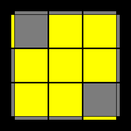

```
B'R'F'RBR'FR
F'LFR'F'L'FR
BL'B'RBLB'R'
FRBR'F'RB'R'
```

### OLL 26


```
L'URU'LUR'
```

### OLL 27


```
LU'R'UL'U'R
```

### OLL 28


```
B'RBLR'U'R'UL'R
FR'F'L'RURU'LR'
F'LFL'RU'L'ULR'
BLUL'B'R'F'U'FR
F'L'U'LFRBUB'R'
BL'B'LR'ULU'L'R
BUB'R'F'L'U'LFR
F'U'FRBLUL'B'R'
LDFD'L'RFU'F'R'
L'DB'D'LR'BUB'R
LD'FDL'RF'U'FR'
L'D'B'DLR'B'UBR
LFR'F'L'RURU'R'
B'FDRD'BF'RU'R'
B'FD'RDBF'R'U'R
B'FDR'D'BF'RUR'
B'FD'R'DBF'R'UR
L'B'RBLR'U'R'UR
```

### OLL 29


```
B'U'R'UF'RBR'FR
```

### OLL 30


```
FURU'BR'F'RB'R'
```

### OLL 31


```
R'U'FURU'R'F'R
LR'UFU'F'L'U'R
```

### OLL 32

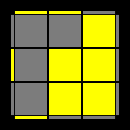

```
RUB'U'R'URBR'
L'RU'B'UBLUR'
```

### OLL 33


```
F'U'FUFR'F'R
BUB'U'B'RBR'
```

### OLL 34


```
FUF'U'R'F'LFL'R
BUB'U'L'B'RBLR'
F'U'FULFR'F'L'R
B'U'BURBL'B'LR'
```

### OLL 35

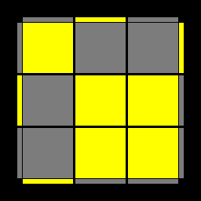

```
RUURRFRF'RUUR'
R'UURRB'R'BR'UUR
RUB'RBRRURUUR'
RUB'RD'RDRRBU'R'
R'U'FR'F'RRU'R'UUR
R'U'FR'DR'D'RRF'UR
FUUF'U'R'FRU'R'F'R
B'UUBURB'R'URBR'
```

### OLL 36


```
R'B'RFR'F'U'R'UBR
R'F'UFU'F'L'U'LFR
L'B'UBLR'FU'F'UR
R'F'U'FFURU'R'F'R
BUB'R'UF'L'U'LFR
```

### OLL 37

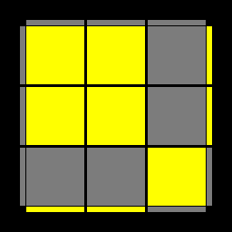

```
FR'F'RURU'R'
B'RBR'U'R'UR
```

### OLL 38

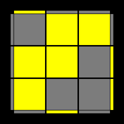

```
RFR'B'RBURU'F'R'
RBUBBU'R'URBR'
LFU'F'L'RB'UBU'R'
RBU'B'UBLUL'B'R'
F'U'FRU'BLUL'B'R'
```

### OLL 39


```
RB'R'U'RUBU'R'
RU'L'B'U'BULR'
LU'R'F'U'FUL'R
```

### OLL 40


```
R'FRUR'U'F'UR
R'ULFUF'U'L'R
L'URBUB'U'LR'
```

### OLL 41


```
LRRD'F'DFRF'L'R
LLRD'B'DBLB'LR'
L'B'RDLBL'D'BLR'
R'F'LDRFR'D'FL'R
LR'F'U'R'F'RFUL'R
L'RB'U'L'B'LBULR'
```

### OLL 42


```
L'RRDBD'B'R'BLR'
LLR'DFD'F'L'FL'R
LFR'D'L'F'LDF'L'R
RBL'D'R'B'RDB'LR'
LR'FULFL'F'U'L'R
L'RBURBR'B'U'LR'
```

### OLL 43


```
R'U'F'UFR
```

### OLL 44


```
RUBU'B'R'
```

### OLL 45


```
R'F'U'FUR
RBUB'U'R'
```

### OLL 46

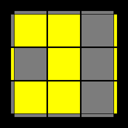

```
RBU'LUL'B'R'
RURB'R'BU'R'
R'F'UL'U'LFR
R'U'R'FRF'UR
```

### OLL 47


```
R'F'U'FUF'U'FUR
```

### OLL 48


```
RBUB'U'BUB'U'R'
```

### OLL 49


```
R'U'RRB'R'BU'B'RBR'
RB'RRBUUBUUB'R
RB'RRFRRBRRF'R
B'R'F'RBR'FU'F'UFR
F'LFR'F'LLULU'FR
RF'UUFUUFRRF'R
BUB'UBU'B'R'F'U'FR
BULU'L'UB'R'F'U'FR
LUFU'F'L'R'U'F'UFR
R'FR'F'RRUUB'RBR'
RBUB'U'RRU'F'UFR
```

### OLL 50


```
RURRFRF'UFR'F'R
R'FRRB'RRF'RRBR'
R'FRRF'UUF'UUFR'
BL'B'RBLLU'L'UB'R'
FRBR'F'RB'UBU'B'R'
F'U'L'ULU'FRBUB'R'
R'BUUB'UUB'RRBR'
L'U'B'UBLRUBU'B'R'
F'U'FU'F'UFRBUB'R'
R'F'U'FURRUBU'B'R'
RB'RBRRUUFR'F'R
```

### OLL 51

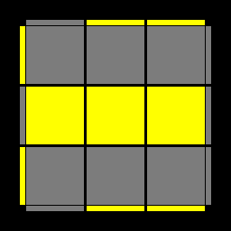

```
RUBU'B'UBU'B'R'
R'U'F'UFU'F'UFR
```

### OLL 52


```
RUBU'BL'B'LB'R'
RUR'URU'BU'B'R'
R'U'F'UF'LFL'FR
R'U'RU'R'UF'UFR
R'F'U'FU'RUR'UR
R'F'LF'L'FU'FUR
RBUB'UR'U'RU'R'
RBL'BLB'UB'U'R'
```

### OLL 53


```
R'FFLFL'F'LFL'FR
RF'U'L'UFRRF'LFR
R'FRF'UURRB'R'BR'
R'FRF'U'FR'F'RRU'R'
R'F'LF'L'FLF'L'FFR
```

### OLL 54


```
R'BULU'B'RRBL'B'R'
RBBL'B'LBL'B'LB'R'
RB'R'BUB'RBRRUR
RB'R'BUURRFRF'R
RBL'BLB'L'BLBBR'
```

### OLL 55


```
B'R'UF'U'FFRBR'F'R
FRU'BUBBR'F'RBR'
```

### OLL 56


```
F'L'U'LUL'FR'F'LFR
BLUL'U'LB'RBL'B'R'
R'F'L'FRRF'U'LUFR'
RBLB'RRBUL'U'B'R
```

### OLL 57


```
BLU'L'B'R'F'UFR
BLFU'F'L'B'R'UR
F'L'ULFRBU'B'R'
F'L'B'UBLFRU'R'
LUL'U'L'RBLB'R'
FUF'LR'DF'D'L'R
F'UFLR'D'F'DL'R
BUB'L'RDB'D'LR'
B'UBL'RD'B'DLR'
L'U'LULR'F'L'FR
FU'F'LR'DFD'L'R
F'U'FLR'D'FDL'R
BU'B'L'RDBD'LR'
B'U'BL'RD'BDLR'
L'FU'F'LR'DFD'R
L'F'U'FLR'D'FDR
BF'UB'U'B'FRBR'
BF'U'FUB'FR'F'R
LBUB'L'RDB'D'R'
LB'UBL'RD'B'DR'
```


