# OLL/PLL Algorithm Discovering

This C++ program enumerates each of all "optimal-moves" OLL/PLL algorithms that ends with R or R'.
The program uses a Bidirectional BFS algorithm.

## OLL Algorithm Discovering
1. Run [PrepareOLL.exe](PrepareOLL.exe) for forward searching, which generates OLL8.dat.
2. Run [DiscoverOLL.exe](DiscoverOLL.exe) for backward searching, which generates [found_oll.txt](found_oll.txt)

## PLL Algorithm Discovering
1. Run [PreparePLL.exe](PreparePLL.exe) for forward searching, which generates PLL8.dat.
2. Run [DiscoverPLL.exe](DiscoverPLL.exe) for backward searching, which generates [found_pll.txt](found_pll.txt)

The program can be stopped at anytime by pressing "ESC", which will end with an incomplete result file.

## OLL Results

### OLL 1


```
F'U'LF'L'FFUFR'F'R
BUL'BLBBU'B'RBR'
```

### OLL 2


```
F'U'FRBULU'L'UB'R'
F'U'FRBUL'BLBBR'
FR'F'RURRB'R'BU'R'
B'RBR'U'RRFRF'UR
BUB'R'F'U'L'ULU'FR
BUB'R'F'U'LF'L'FFR
RBR'ULU'L'RUB'U'R'
R'U'F'UL'RU'LUR'FR
BUB'UR'F'L'U'LU'FR
R'F'RU'L'ULR'U'FUR
F'U'FU'RBLUL'UB'R'
RUBU'LR'UL'U'RB'R'
BLU'FU'F'L'B'UR'UR
BLU'FUF'U'L'B'R'UR
R'U'BFFLFL'B'UFR
BLLF'L'FU'L'B'R'UR
LFUF'U'L'RUBU'B'R'
RBUF'LU'L'UB'FU'R'
RBUF'L'BLBBFU'R'
RUBF'U'LUL'FU'B'R'
R'U'BF'UL'U'LB'UFR
F'LLBLB'ULFRU'R'
R'F'U'BL'ULU'B'FUR
R'F'U'BLF'L'B'FFUR
L'B'U'BULR'U'F'UFR
RUBBF'L'B'LFU'B'R'
F'L'UB'UBLFU'RU'R'
F'L'UB'U'BULFRU'R'
```

### OLL 3


```
R'UFR'F'R'DL'B'LD'R'
BLUL'U'B'R'U'F'UFR
B'U'R'URBRBUB'U'R'
F'U'L'UFR'F'LU'FUR
F'U'L'ULFR'F'U'FUR
FURU'BR'F'RUB'U'R'
FURU'R'F'RBUB'U'R'
BULU'L'B'R'F'U'FUR
R'D'LF'L'DRUFR'F'R
R'D'LF'L'DR'B'R'BUR'
RB'R'BURDL'B'LD'R'
```

### OLL 4


```
RU'B'RBRD'LFL'DR
F'L'U'LUFRUBU'B'R'
B'U'R'URBR'F'U'FUR
B'U'R'UF'RBR'U'FUR
F'U'L'ULFRBUB'U'R'
FURU'R'F'R'F'U'FUR
BULU'B'RBL'UB'U'R'
BULU'L'B'RBUB'U'R'
R'FRF'U'R'D'LFL'DR
RDL'BLD'RFRF'U'R
RDL'BLD'R'U'B'RBR'
```

### OLL 5


```
R'FFLFL'FR
```

### OLL 6

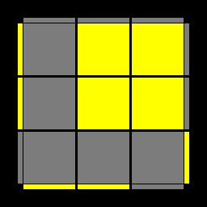

```
RBBL'B'LB'R'
```

### OLL 7


```
RBL'BLBBR'
```

### OLL 8

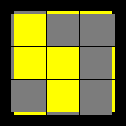

```
R'F'LF'L'FFR
```

### OLL 9


```
B'U'BRB'R'URBR'
R'F'UL'U'LU'FUR
```

### OLL 10

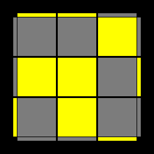

```
FUF'R'FRU'R'F'R
RBU'LUL'UB'U'R'
```

### OLL 11

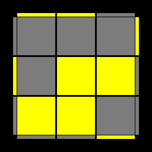

```
B'R'U'RUBR'F'U'FUR
RD'BRULU'L'R'B'DR'
F'L'U'LUFRBUB'U'R'
BLUL'B'RDL'B'LD'R'
BLUL'UB'RRFRF'R
RRDL'B'LD'R'BUB'R'
F'UUFURBLUL'B'R'
R'F'UFRRDL'B'LD'R'
RU'LBUFU'B'F'L'UR'
RBL'BL'DLD'LBBR'
RBUB'U'BL'BLBBR'
```

### OLL 12


```
FRUR'U'F'RBUB'U'R'
R'DF'R'U'L'ULRFD'R
F'L'U'LFR'D'LFL'DR
F'L'U'LU'FRRB'R'BR'
RRD'LFL'DRF'U'FR
BLUL'U'B'R'F'U'FUR
R'F'U'FUF'LF'L'FFR
R'F'LF'LD'L'DL'FFR
R'UL'F'U'B'UBFLU'R
BUUB'U'R'F'L'U'LFR
RBU'B'RRD'LFL'DR
```

### OLL 13

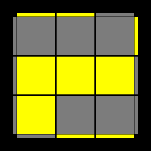

```
FR'F'U'FRF'R'UR
```

### OLL 14


```
B'RBUB'R'BRU'R'
```

### OLL 15

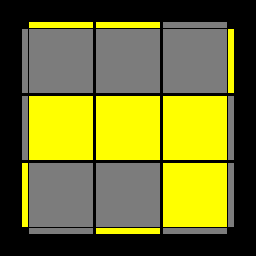

```
BLB'R'BUL'U'B'R
R'F'L'RU'LUR'FR
```

### OLL 16


```
F'L'FRF'U'LUFR'
RBLR'UL'U'RB'R'
```

### OLL 17

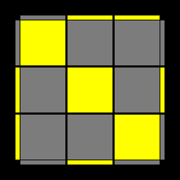

```
FR'F'RUURU'BU'B'R'
RU'B'RBLRD'FDL'R
R'UFR'F'L'R'DB'D'LR'
B'RBR'UUR'UF'UFR
R'U'F'LUF'U'L'UFFR
LU'F'LFLRD'BDLR'
RUBL'U'BULU'BBR'
L'UBL'B'L'R'DF'D'L'R
F'U'L'ULU'FUFR'F'R
BULU'L'UB'U'B'RBR'
LF'L'FULR'DF'D'L'R
R'FRF'U'LR'D'FDL'R
RB'R'BUL'RDB'D'LR'
L'BLB'U'L'RD'BDLR'
```

### OLL 18

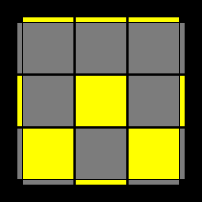

```
F'U'FRBLUL'UB'U'R'
FR'F'RURU'BUB'U'R'
B'RBR'U'R'UF'U'FUR
BUB'R'F'L'U'LU'FUR
F'L'U'LU'FUUFR'F'R
BLUL'UB'UUB'RBR'
F'U'L'UB'UBLFRU'R'
BULU'FU'F'L'B'R'UR
F'UUFRBLUL'UB'R'
BLU'FU'F'L'B'R'UUR
F'L'UB'UBLFRUUR'
BUUB'R'F'L'U'LU'FR
```

### OLL 19

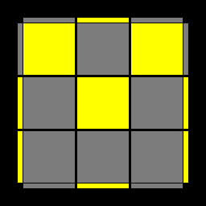

```
RBBUL'U'B'ULB'U'R'
R'FFU'LUFU'L'FUR
LR'D'F'DL'RUFR'F'R
LR'D'F'DL'R'B'R'BUR'
L'RDBD'LRFRF'U'R
L'RDBD'LR'U'B'RBR'
```

### OLL 20


```
L'U'BULB'U'B'RUBU'R'
LUF'U'L'FUFR'U'F'UR
LR'U'F'UFUFUF'U'L'R
RUBF'ULUL'U'B'FU'R'
RUBF'ULU'L'U'B'FU'R'
L'RU'B'UBUBUB'U'LR'
LR'UFU'F'U'F'U'FUL'R
R'U'BF'U'L'ULUB'FUR
R'U'BF'U'L'U'LUB'FUR
L'RUBU'B'U'B'U'BULR'
```

### OLL 21

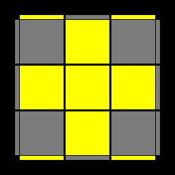

```
L'U'LU'L'U'RU'LUR'
LUL'ULUR'UL'U'R
```

### OLL 22


```
L'URU'LU'R'U'RU'R'
LU'R'UL'URUR'UR
```

### OLL 23


```
B'URU'R'U'BRUUR'
FU'R'URUF'R'UUR
FUUF'R'UFUF'U'R
B'UUBRU'B'U'BUR'
```

### OLL 24


```
FRB'R'F'RBR'
B'R'FRBR'F'R
BLB'RBL'B'R'
F'L'FR'F'LFR
```

### OLL 25


```
B'R'F'RBR'FR
F'LFR'F'L'FR
BL'B'RBLB'R'
FRBR'F'RB'R'
```

### OLL 26


```
L'URU'LUR'
```

### OLL 27


```
LU'R'UL'U'R
```

### OLL 28


```
B'RBLR'U'R'UL'R
FR'F'L'RURU'LR'
F'LFL'RU'L'ULR'
BLUL'B'R'F'U'FR
F'L'U'LFRBUB'R'
BL'B'LR'ULU'L'R
BUB'R'F'L'U'LFR
F'U'FRBLUL'B'R'
LDFD'L'RFU'F'R'
L'DB'D'LR'BUB'R
LD'FDL'RF'U'FR'
L'D'B'DLR'B'UBR
LFR'F'L'RURU'R'
B'FDRD'BF'RU'R'
B'FD'RDBF'R'U'R
B'FDR'D'BF'RUR'
B'FD'R'DBF'R'UR
L'B'RBLR'U'R'UR
```

### OLL 29

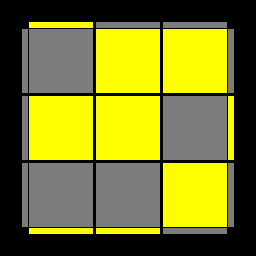

```
B'U'R'UF'RBR'FR
```

### OLL 30

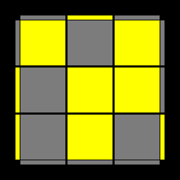

```
FURU'BR'F'RB'R'
```

### OLL 31

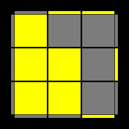

```
R'U'FURU'R'F'R
LR'UFU'F'L'U'R
```

### OLL 32


```
RUB'U'R'URBR'
L'RU'B'UBLUR'
```

### OLL 33


```
F'U'FUFR'F'R
BUB'U'B'RBR'
```

### OLL 34


```
FUF'U'R'F'LFL'R
BUB'U'L'B'RBLR'
F'U'FULFR'F'L'R
B'U'BURBL'B'LR'
```

### OLL 35


```
RUURRFRF'RUUR'
R'UURRB'R'BR'UUR
RUB'RBRRURUUR'
RUB'RD'RDRRBU'R'
R'U'FR'F'RRU'R'UUR
R'U'FR'DR'D'RRF'UR
FUUF'U'R'FRU'R'F'R
B'UUBURB'R'URBR'
```

### OLL 36


```
R'B'RFR'F'U'R'UBR
R'F'UFU'F'L'U'LFR
L'B'UBLR'FU'F'UR
R'F'U'FFURU'R'F'R
BUB'R'UF'L'U'LFR
```

### OLL 37


```
FR'F'RURU'R'
B'RBR'U'R'UR
```

### OLL 38


```
RFR'B'RBURU'F'R'
RBUBBU'R'URBR'
LFU'F'L'RB'UBU'R'
RBU'B'UBLUL'B'R'
F'U'FRU'BLUL'B'R'
```

### OLL 39


```
RB'R'U'RUBU'R'
RU'L'B'U'BULR'
LU'R'F'U'FUL'R
```

### OLL 40

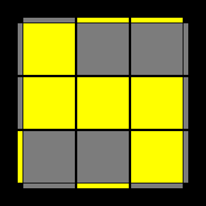

```
R'FRUR'U'F'UR
R'ULFUF'U'L'R
L'URBUB'U'LR'
```

### OLL 41


```
LRRD'F'DFRF'L'R
LLRD'B'DBLB'LR'
L'B'RDLBL'D'BLR'
R'F'LDRFR'D'FL'R
LR'F'U'R'F'RFUL'R
L'RB'U'L'B'LBULR'
```

### OLL 42


```
L'RRDBD'B'R'BLR'
LLR'DFD'F'L'FL'R
LFR'D'L'F'LDF'L'R
RBL'D'R'B'RDB'LR'
LR'FULFL'F'U'L'R
L'RBURBR'B'U'LR'
```

### OLL 43


```
R'U'F'UFR
```

### OLL 44

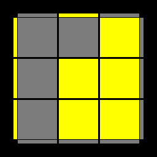

```
RUBU'B'R'
```

### OLL 45


```
R'F'U'FUR
RBUB'U'R'
```

### OLL 46


```
RBU'LUL'B'R'
RURB'R'BU'R'
R'F'UL'U'LFR
R'U'R'FRF'UR
```

### OLL 47

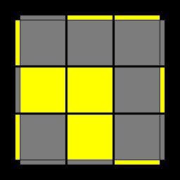

```
R'F'U'FUF'U'FUR
```

### OLL 48


```
RBUB'U'BUB'U'R'
```

### OLL 49

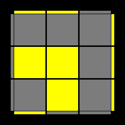

```
R'U'RRB'R'BU'B'RBR'
RB'RRBUUBUUB'R
RB'RRFRRBRRF'R
B'R'F'RBR'FU'F'UFR
F'LFR'F'LLULU'FR
RF'UUFUUFRRF'R
BUB'UBU'B'R'F'U'FR
BULU'L'UB'R'F'U'FR
LUFU'F'L'R'U'F'UFR
R'FR'F'RRUUB'RBR'
RBUB'U'RRU'F'UFR
```

### OLL 50

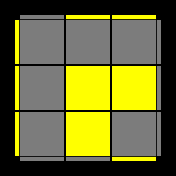

```
RURRFRF'UFR'F'R
R'FRRB'RRF'RRBR'
R'FRRF'UUF'UUFR'
BL'B'RBLLU'L'UB'R'
FRBR'F'RB'UBU'B'R'
F'U'L'ULU'FRBUB'R'
R'BUUB'UUB'RRBR'
L'U'B'UBLRUBU'B'R'
F'U'FU'F'UFRBUB'R'
R'F'U'FURRUBU'B'R'
RB'RBRRUUFR'F'R
```

### OLL 51


```
RUBU'B'UBU'B'R'
R'U'F'UFU'F'UFR
```

### OLL 52

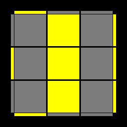

```
RUBU'BL'B'LB'R'
RUR'URU'BU'B'R'
R'U'F'UF'LFL'FR
R'U'RU'R'UF'UFR
R'F'U'FU'RUR'UR
R'F'LF'L'FU'FUR
RBUB'UR'U'RU'R'
RBL'BLB'UB'U'R'
```

### OLL 53

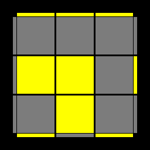

```
R'FFLFL'F'LFL'FR
RF'U'L'UFRRF'LFR
R'FRF'UURRB'R'BR'
R'FRF'U'FR'F'RRU'R'
R'F'LF'L'FLF'L'FFR
```

### OLL 54

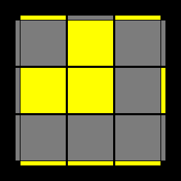

```
R'BULU'B'RRBL'B'R'
RBBL'B'LBL'B'LB'R'
RB'R'BUB'RBRRUR
RB'R'BUURRFRF'R
RBL'BLB'L'BLBBR'
```

### OLL 55


```
B'R'UF'U'FFRBR'F'R
FRU'BUBBR'F'RBR'
```

### OLL 56


```
F'L'U'LUL'FR'F'LFR
BLUL'U'LB'RBL'B'R'
R'F'L'FRRF'U'LUFR'
RBLB'RRBUL'U'B'R
```

### OLL 57


```
BLU'L'B'R'F'UFR
BLFU'F'L'B'R'UR
F'L'ULFRBU'B'R'
F'L'B'UBLFRU'R'
LUL'U'L'RBLB'R'
FUF'LR'DF'D'L'R
F'UFLR'D'F'DL'R
BUB'L'RDB'D'LR'
B'UBL'RD'B'DLR'
L'U'LULR'F'L'FR
FU'F'LR'DFD'L'R
F'U'FLR'D'FDL'R
BU'B'L'RDBD'LR'
B'U'BL'RD'BDLR'
L'FU'F'LR'DFD'R
L'F'U'FLR'D'FDR
BF'UB'U'B'FRBR'
BF'U'FUB'FR'F'R
LBUB'L'RDB'D'R'
LB'UBL'RD'B'DR'
```

## PLL Results

### PLL 1

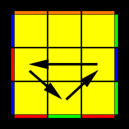

```
R'F'LR'DFD'L'RFU'R
RRU'R'U'RURURU'R
RU'BL'RD'BDLR'B'R'
RU'RURURU'R'U'RR
R'B'D'URUR'DU'BU'R
LUFU'F'L'R'F'U'FUR
RU'FDU'R'URD'UF'R'
RRU'B'FRRBF'U'RR
```

### PLL 2

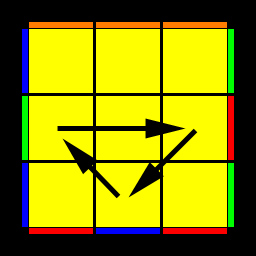

```
RBL'RD'B'DLR'B'UR'
RRURUR'U'R'U'R'UR'
R'UF'LR'DF'D'L'RFR
L'U'B'UBLRBUB'U'R'
R'UR'U'R'U'R'URURR
RFDU'R'U'RD'UF'UR'
R'UB'D'URU'R'DU'BR
RRUB'FRRBF'URR
```

### PLL 3

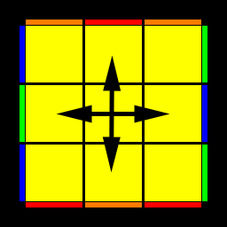

```
BFUUB'F'L'R'UULR
B'F'UUBFLRUUL'R'
```

### PLL 4


```
UBL'B'LRB'L'RB'LBRR
FUFR'F'RU'F'RUBU'B'R'
U'FFR'B'RBF'RB'F'RBR'
U'F'LFL'R'FLR'FL'F'RR
UBBRFR'BF'R'BFR'F'R
B'U'B'RBR'UBR'U'F'UFR
F'L'U'LUFR'F'L'ULU'FR
F'L'U'LUFR'U'FR'F'RUR
B'R'UF'U'FRBR'U'F'UFR
FRU'BUB'R'F'RUBU'B'R'
BLUL'U'B'RBLU'L'UB'R'
BLUL'U'B'RUB'RBR'U'R'
```

### PLL 5


```
RBURU'L'UR'U'LB'R'
R'B'UR'D'RU'R'DRBR
RBFR'F'RB'R'FRF'R'
R'BFR'BRF'R'B'RB'R
RUBLB'R'BL'B'RU'R'
RDUL'D'LU'L'DLD'R'
R'DUL'DLU'L'D'LD'R
R'D'FL'B'LF'L'BLDR
R'F'LU'R'UL'U'RUFR
RBBU'F'UB'U'FUB'R'
RFRDR'U'RD'R'UF'R'
L'UR'DDRU'R'DDLR
R'D'LDL'U'LD'L'DUR
R'UL'DDLU'L'DDLR
LRDDL'U'LDDL'UR'
R'U'FDF'U'FD'F'UUR
RD'LD'L'U'LDL'DUR'
RU'FD'F'U'FDF'UUR'
R'FFD'BDF'D'B'DF'R
RDLFL'B'LF'L'BD'R'
RRFFR'B'RFFR'BR'
R'U'RF'L'FR'F'LFUR
RF'RF'R'B'RFR'BFR'
RB'DF'D'B'DFD'BBR'
R'B'RBR'F'RB'R'BFR
R'FR'BBRF'R'BBRR
R'F'UBU'F'UB'U'FFR
RUUB'D'BU'B'DBU'R'
R'UUB'DBU'B'D'BU'R
```

### PLL 6


```
RFU'RDR'URD'R'F'R'
RB'F'RF'R'BRFR'FR'
R'B'F'RBR'FRB'R'BR
R'F'U'R'ULU'RUL'FR
RD'U'LD'L'ULDL'DR'
R'D'U'LDL'ULD'L'DR
RDB'LFL'BLF'L'D'R'
R'U'F'L'FRF'LFR'UR
RBL'URU'LUR'U'B'R'
R'FFUBU'FUB'U'FR
LU'RDDR'URDDL'R'
RU'LDDL'ULDDL'R'
R'DL'DLUL'D'LD'U'R
L'R'DDLUL'DDLU'R
RBBDF'D'BDFD'BR'
R'UB'DBUB'D'BUUR
R'B'R'D'RUR'DRU'BR
RDL'D'LUL'DLD'U'R'
RUB'D'BUB'DBUUR'
RB'RFFR'BRFFRR
RUUFD'F'UFDF'UR'
R'UUFDF'UFD'F'UR
RFR'F'RBR'FRB'F'R'
RBU'F'UBU'FUBBR'
RUR'BLB'RBL'B'U'R'
R'BR'BRFR'B'RB'F'R
R'FD'BDFD'B'DFFR
RRBBRFR'BBRF'R
R'D'L'B'LFL'BLF'DR
```

### PLL 7

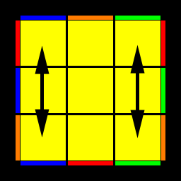

```
FRBR'F'LRFL'B'LF'L'R'
BLFL'B'LRBR'F'RB'L'R'
F'L'B'LFL'R'F'RBR'FLR
B'R'F'RBL'R'B'LFL'BLR
BFRF'LFR'B'F'RBL'B'R'
B'F'R'BL'B'RBFR'F'LFR
```

### PLL 8

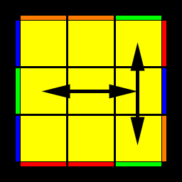

```
FRU'R'F'URU'BL'ULB'UR'
B'R'URBU'R'UF'LU'L'FU'R
F'UL'BUB'LU'FUR'F'U'FR
BU'LF'U'FL'UB'U'RBUB'R'
FRU'R'URURRF'RURU'R'
ULFU'F'RUR'FUF'L'RU'R'
UL'U'LR'F'UFL'ULF'U'FR
B'R'URU'R'U'RRBR'U'R'UR
U'L'B'UBR'U'RB'U'BLR'UR
U'LUL'RBU'B'LU'L'BUB'R'
FR'DR'BRDB'D'B'D'RRF'R'
BRBBDLDLD'B'L'BD'BR'
RDBBLBDLD'B'L'BD'BR'
RB'DB'LBDL'D'B'L'BBD'R'
B'RD'RF'R'D'FDFDRRBR
F'R'FFD'L'D'L'DFLF'DF'R
R'FD'FL'F'D'LDFLFFDR
R'D'FFL'F'D'L'DFLF'DF'R
F'U'FUFR'FFUFUF'U'FR
F'R'FFD'LFUL'U'L'F'DF'R
RFUURUFRF'U'R'UF'UR'
RU'FU'RUFR'F'U'R'UUF'R'
B'RD'RFUFU'R'F'DRRBR
BUB'U'B'RBBU'B'U'BUB'R'
BRBBDL'B'U'LULBD'BR'
R'B'UUR'U'B'R'BURU'BU'R
R'UB'UR'U'B'RBURUUBR
FR'DR'B'U'B'URBD'RRF'R'
```

### PLL 9

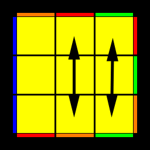

```
BUB'UUL'UR'U'LRUB'RBR'
BLB'RBR'UL'U'LRU'L'UB'R'
B'RBR'UBFU'B'UF'UUR'UR
B'R'UF'U'BFU'F'UB'RBR'FR
R'URU'RRF'U'FURFR'F'RR
RU'FRUFRDF'U'FD'F'R'F'R'
RRB'R'BRUBU'B'RRU'RUR'
R'B'R'B'D'BU'B'DRBURBU'R
```

### PLL 10

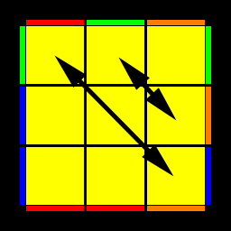

```
R'B'R'BU'BUBBRBURU'R
RFRF'UF'U'FFR'F'U'R'UR'
RU'RUFRFFUFU'FR'F'R'
RU'RUFD'FDFFRFR'F'R'
RU'RUFD'FL'FLFFDF'R'
RFRF'R'FFD'F'DF'U'R'UR'
RFD'FFL'F'LF'DF'U'R'UR'
R'UR'U'B'R'BBU'B'UB'RBR
R'B'DBBLBL'BD'BURU'R
R'B'R'BRBBDBD'BURU'R
R'UR'U'B'DB'D'BBR'B'RBR
R'UR'U'B'DB'LB'L'BBD'BR
```

### PLL 11


```
RRU'RB'D'RDRFR'F'R'BR
R'B'RFRF'RBUR'U'RURR
RFR'B'R'BRDRD'F'RU'RR
RRURRB'RFDR'D'BRF'R'
RRUR'FDR'D'R'B'RBRF'R'
RRU'RRFR'B'D'RDF'R'BR
R'B'RFRF'R'D'R'DBR'URR
RFR'B'R'BR'F'U'RUR'U'RR
RRURU'R'UFRB'RBRF'R'
RRU'RF'R'URUFU'F'U'FR
LRBUUL'ULUB'L'BUB'R'
R'F'UFL'F'ULUL'UUFLR
RBU'B'U'BURUR'B'RU'RR
L'B'UBR'B'URUR'UUBLR
RRU'R'URU'B'R'FR'F'R'BR
RRUR'BRU'R'U'B'UBUB'R'
L'R'F'UULU'L'U'FLF'U'FR
LFU'F'RFU'R'U'RUUF'L'R'
R'F'UFUF'U'R'U'RFR'URR
RBU'B'LBU'L'U'LUUB'L'R'
R'B'RFD'R'DBRF'RRURR
RFR'B'DRD'F'R'BRRU'RR
R'F'UFR'D'FLFL'FFDRR
RRD'FFLF'L'F'DRF'U'FR
RRDBBL'BLBD'R'BUB'R'
RBU'B'RDB'L'B'LBBD'RR
```

### PLL 12


```
B'RBRRUF'L'ULFU'R
URRFRFFL'ULFU'R
B'D'RFRF'RRDBR'UR
U'R'U'BRB'U'BR'B'UUR
B'URUR'UUBRB'UBR'
B'RFDR'D'BRF'RURR
F'L'U'FR'F'LF'D'F'DF'R
FFL'U'LFFR'DR'D'RR
FFU'F'LF'R'DFD'L'F'R
LU'R'UL'UURU'R'UUR
FDFD'L'FU'F'LF'R'F'R
U'R'UF'L'U'LFFR'F'RR
U'L'UR'UULU'L'UULR
L'UULUL'UURU'LUR'
U'R'UL'UURU'R'UULR
UL'R'UURUR'UULU'R
F'R'UFUF'UURFR'UR
F'L'U'FUF'U'F'LF'R'F'R
UR'UB'URUR'U'BUUR
F'UL'B'U'BLU'FFR'F'R
UR'U'B'U'BRB'UBR'UR
B'RD'RDRF'RBR'UFR
B'RBRD'F'RUR'FDRR
F'U'FR'D'FFLF'L'F'DR
BBDBD'BRRF'UFRR
FFD'L'FU'F'LDF'R'F'R
FR'U'RF'R'UUFU'F'U'R
B'RBRF'RURU'R'UFR
B'RBRF'RUR'FDR'D'R'
UR'UUBRB'UBR'B'UR
U'R'U'RB'U'BR'B'UBUR
B'U'BR'B'UURU'R'U'BR
U'R'UUB'URU'R'U'BU'R
```

### PLL 13


```
FR'F'RRU'BLU'L'B'UR'
FU'R'U'RUUF'R'FU'F'R
FR'B'D'RDF'R'BR'U'RR
BLUB'RBL'BDBD'BR'
URUF'R'FUF'RFUUR'
U'RRB'R'BBLU'L'B'UR'
FDR'B'R'BRRD'F'RU'R'
L'URU'LUUR'URUUR'
B'D'B'DLB'UBL'BRBR'
URU'BLUL'BBRBRR
BBLUL'BBRD'RDRR
BBUBL'BRD'B'DLBR'
ULU'RUUL'ULUUL'R'
URU'LUUR'URUUL'R'
U'LRUUR'U'RUUL'UR'
BU'LFUF'L'UBBRBR'
U'RUFUF'R'FU'F'RU'R'
LUUL'U'LUUR'UL'U'R
U'RU'FU'R'U'RUF'UUR'
BLUB'U'BUBL'BRBR'
BRU'B'U'BUUR'B'RU'R'
BUB'RDBBL'BLBD'R'
FR'F'R'DBR'U'RB'D'RR
FFD'F'DF'RRBU'B'RR
FR'DR'D'R'BR'F'RU'B'R'
FUF'RFUUR'URUF'R'
URUR'FUF'RFU'F'U'R'
URUUFU'R'URUF'UR'
U'RUUF'R'FU'F'RFU'R'
B'RUR'BRUUB'UBUR'
FR'F'R'BR'U'RB'D'RDR
FR'F'R'BR'U'R'URU'B'R'
BBDLB'UBL'D'BRBR'
```

### PLL 14

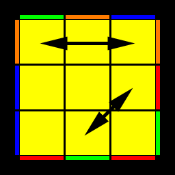

```
UR'UF'LFRF'L'FUR'UUR
UR'URULR'D'L'ULDL'UR
B'RBR'UBULUL'B'R'UUR
RRFRUR'U'R'UF'R'FU'F'R'
U'R'U'LD'L'U'LDL'RU'R'U'R
RFUF'RFU'RURU'R'F'RR
F'UUFRBU'B'U'R'U'FR'F'R
U'R'UURU'F'LFR'F'L'FU'R
```

### PLL 15

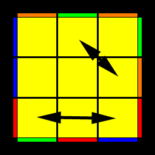

```
U'RU'R'U'L'RDLU'L'D'LU'R'
U'RU'BL'B'R'BLB'U'RUUR'
RRB'R'U'RURU'BRB'UBR
URUL'DLUL'D'LR'URUR'
BUUB'R'F'UFURUB'RBR'
R'B'U'BR'B'UR'U'R'URBRR
FR'F'RU'F'U'L'U'LFRUUR'
URUUR'UBL'B'RBLB'UR'
```

### PLL 16


```
R'FFL'FRF'U'LUFR'FR
FFD'LU'LUL'DFFRU'R'
```

### PLL 17


```
R'F'RF'U'L'UFR'F'LFFR
BUB'RRD'FU'F'UF'DRR
```

### PLL 18


```
RBBLB'R'BUL'U'B'RB'R'
BBDL'UL'U'LD'BBR'UR
```

### PLL 19

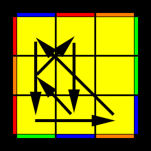

```
RBR'BULU'B'RBL'BBR'
F'U'FRRDB'UBU'BD'RR
```

### PLL 20


```
LU'RUUL'ULR'U'RUUL'UR'
BUBU'B'UL'D'RB'R'DLRB'R'
FRB'F'D'FRF'DBU'RUR'U'R'
```

### PLL 21

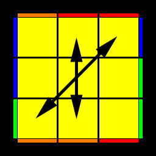

```
L'UR'UULU'L'RUR'UULU'R
F'U'F'UFU'LDR'FRD'L'R'FR
B'R'BFDB'R'BD'F'UR'U'RUR
```

