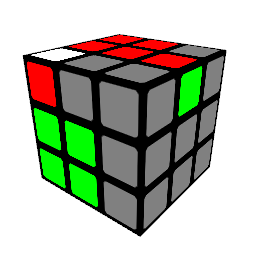
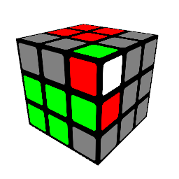
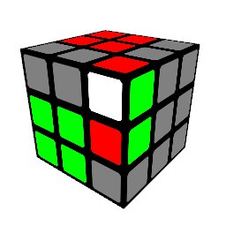

# Modified F2L

1
 
 (lDR'D'l')(U'RU)

2
 
 (R'U'RU)(lDR'D')

3
 
 (FRF')(R'FR2F')(R'FRF')

4
 
 (U'R'U)(RU'R'2U)(RU'R'U)

5
 
 (FR'FRD)(R'D'F2)

6
 
 (F2DR)(D'R'F'RF')

7
 
 (U'R'U)(RU'R'U)

8
 
 (FRF')(R'FRF')

9
 
 (FR'F')(lDR'D')

10
 
 (U'RUR')(U'RU)

11
 
 (FR2F'R)(FR2F'R)(U'R'U)

12
 
 lDR'D'

13
 
 R'U'RU

14
 
 (FR'F')(U'R2U)

15
 
 U'R'U

16
 
 FRF'

17
 
 (FRF'R')(FRF')(R'FRF')

18
 
 (x'R'DR'D')(R'2DR'D')

19
 
 (RU'RU)(R2U'RU)

20
 
 (R'FRF')(RU'R'U)

21
 
 (RU'R'U)(R'FRF')

22
 
 (FRF'R)(U'RU)(R'U'RU)

23
 
 (U'R'UR')(FR'F')(lDR'D')

24
 
 (U'R'2U)(RU'R'U)

25
 
 (FR2F')(R'FRF')

26
 
 (R'U'R2U)(R'U'RU)

27
 
 (RFR'2F')(lDR'D')

28
 
 (R2U'R'U)(R'U'RU)

29
 
 (R'2FRF')(lDR'D')

30
 
 (l'URU')l'2(DR'D')

31
 
 (RU'R'U)R'2(U'RU)

32
 
 (l'UR2)(U'l'2)(DR'D')

33
 
 (RU'R2)(UR'2)(U'RU)

34
 
 (U'lU'R)(Ul'R'U)

35
 
 (FR'DR')(D'R2F')

36
 
 (R'FR'F'R)(U'R'U)
 or (RU'xl')(DR'D'R'D)

37
 
 (RU'RUR')(FRF')
 or (l'URU'R)(UlF')

38
 
 (l'UR2U'l)(U'R'U)

39
 
 (RU'R'2UR')(FRF')

40
 
 (RU'RUR')(U'R'U)

41
 
 (R'FR'F'R)(FRF')

