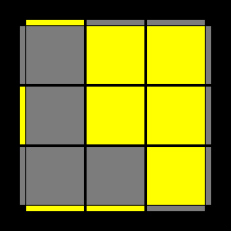

# Modified OLL

 1.F(RUR'U')F'
 2.B'(R'U'RU)B

 3.f(RUR'U')f'

 4.b'(R'U'RU)b

 5.RU2R'U'RU'R'

 6.R'U2RUR'UR

 7.(RU2)(R'U'RUR'U')(RU'R')
 8.(R'U2)(RUR'U'RU)(R'UR)

 9.R'U2(R'2U)(R'2U)(R'2U2)R'

 10.(R2D')(RU2)(R'D)(RU2R)

 11.x'RUR'z'(RU)(L'U'R')

 12.F'(rUR'U')(r'FR)

 13.x'(RU'R'D)(RUR'D')

 14.F(RUR'U')(RUR'U')F'

 15.B'(R'U'RU)(R'U'RU)B

 16.f(RUR'U')(RUR'U')f'
 17.b'(R'U'RU)(R'U'RU)b

 18.F(RUR'U')F'f(RUR'U')f'

 19.f(RUR'U')f'y'F(RUR'U')F'

 20.b'(R'U'RU)byF(RUR'U')F'

 21.F(RUR'U')F'yF(RUR'U')F'

 22.B'(R'U'RU)By'B'(R'U'RU)B

 23.(r'U2)(RUR'U)r

 24.(rU2)(R'U'RU')r'

 25.r'(U'RU'R')(U'2r)

 26.r(UR'UR)(U2r')

 27.(r'U2)(RUR'U')(RUR'U)r

 28.(rU2)(R'U'RU)(R'U'RU')r'

 29.(R'U'R)y'x'(RU')(R'F)(RUR')

 30.(LUL')yx'(L'U)(LF')(L'U'L)

 31.(rU'r'U')(rUr')zx(U'RU)z'

 32.(l'UlU)(l'U'l)zx'(DR'D')z'

 33.(rUR'U')(r'RU)(RU'R')

 34.(RUR'U'r)(R'U)(RU'r')

 35.(RU2R'U'RU'R')y'B'(R'U'RU)B

 36.(R'U2RUR'UR)yF(RUR'U')F'

 37.x'(RU')(R'2D)(R2U)(R'2D')R

 38.x'(R'D)(R2U')(R'2D')(R2U)R'

 39.(R'U'RU)(RB'R'B)

 40.B'(R'URUR'U')(RB)

 41.(R'U'RU')(R'U)y'(R'U)(RB)

 42.(R'U')(R'FRF')(UR)

 43.(R'U'R U)x'z'(RU)(L'U')rR'

 44.(RU'U')(R2'FRF')U2(R'FRF')

 45.f(RUR'U')f'y2(R'U'RU')(R'U)y'(R'U)(RB)

 46.(r'U'r)(R'U'RU)(r'Ur)
 47.f(RUR'U')f'y'b'(R'U'RU)b

 48.(rUr')(RUR'U')(rU'r')
 49.b'(R'U'RU)byf(RUR'U')f'

 50.(RU)(B'U')(R'URBR')
 51.f(RUR'U')f'yx'RUR'z'(RU)(L'U'R')

 52.(L'U')(BU)(LU'L'B'L)

 53.b'(R'U'RU)byx'RUR'z'(RU)(L'U'R')

 54.(rU'r'U'r)y(RUR'f')

 55.B'(R'U'RU)Bx'RUR'z'(RU)(L'U'R')

 56.(l'UlUl')y'(L'U'Lf)
 57.F(RUR'U')F'y2x'RUR'z'(RU)(L'U'R')

 58.(R'U'RU')(R'URU)(RB'R'B)

 59.(RU2R'U'RU'R')y2b'(R'U'RU)b

 60.(RUR'U)(RU'R'U')(R'FRF')

 61.(R'U2RUR'UR)y2f(RUR'U')f'

 62.(RU'2R2'FRF')(RU'2R')
 63.f(RUR'U')f'y'(R'U2RUR'UR)

 64.F(RUR'U')(RF')(rUR'U')r'
 65.F(RUR'U')F'y'x'RUR'z'(RU)(L'U'R')

 66.(RUR'U')(RU'R'F'U'F)(RUR')
 67.F(RUR'U')F'y2(R'U'RU)(RB'R'B)

 68.b'(R'U'RU)by2F'(rUR'U')(r'FR)

 69.(R2UR'B')(RU')(R2'U)(RBR')
 70.f(RUR'U')f'yF'(rUR'U')(r'FR)

 71.B'(R'U'RU)By2(R'U'RU)(RB'R'B)

 72.(RUR'U)(R'FRF'U2)(R'FRF')
 73.f(RUR'U')f'y'(R'U'RU)(RB'R'B)

 74.F(RUR'd)(R'U2)(R'FRF')
 75.F(RUR'U')F'yr'(U'RU'R')(U'2r)

 76.(R'U2)(FRUR'U')y'(R2U2RB)

 77.B'(R'URUR'U')(RB)y'B'(R'U'RU)B

 78.r'(RU)(RUR'U'r2)(R2'U)(RU')r'
 79.f(RUR'U')f'(R'U')(R'FRF')(UR)

 80.(RU2)(R'2U')(RU'R'U2)(FRF')
 81.(R'U')(R'FRF')(UR)yx'RUR'z'(RU)(L'U'R')

