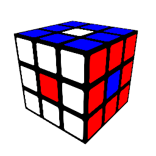
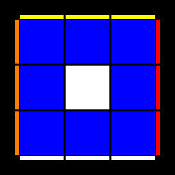
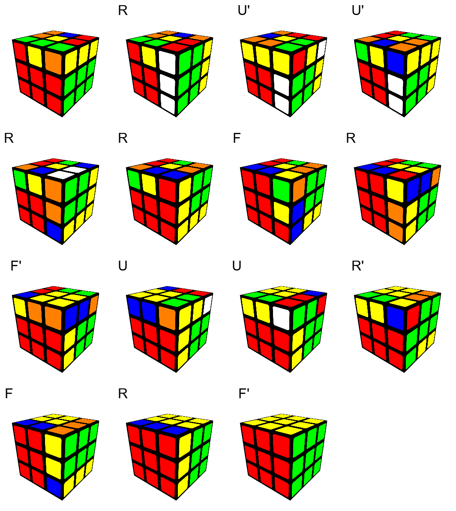
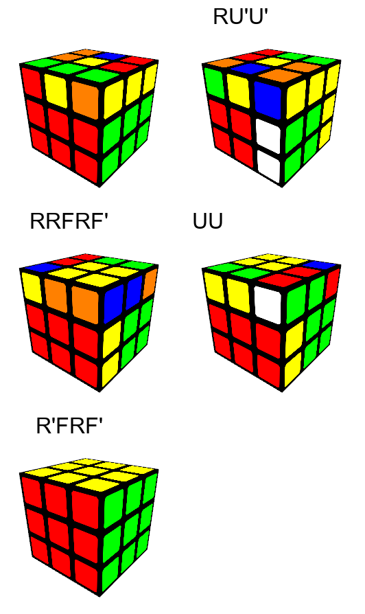

# Some Rubic's Cube Notes

## Content

* RubikNotes.py: A script for generating the illustrations.
* [Gan's CFOP](CFOPRemade): A quite old version of Gan's CFOP, remade.
* Fei's Modified CFOP
  * [F2l](FeiF2L)
* [Reconstruction Maintenance Test](Reconstruction): On [Speedsolving](https://www.speedsolving.com/threads/better-way-of-maintaining-personal-reconstructions.79746/), I see there's abunickabhi's demand of maintaining a large number of reconstructions. I believe github-pages + AnimCubeJS is a promising solution. You can create your own 'database' by simply forking this repo.

## Usage of RubikNotes.py

### Install dependencies

```
$ pip install pillow
$ pip install VkInline
```
VkInline requires Win64/Linux64 with Vulkan enabled GPU driver.

### Basic example

```python
import glm
from RubikNotes import RubiksCube, PerspectiveView, TopView

# Create a Rubik's cube state holder
cube = RubiksCube() 

'''
Execute a sequence to change the state of the cube
Single-layer: RLUDFB
Dual-layer: rludfb
Whole-cube rotate: xyz
Middle Slice: EMS
Counterclockwise: add an apostrophe R'L'U'...
Rotate twice: add a '2' R2 L2 R'2

Optional: 
Setting parameter reverse=True will reverse the execution. This would be helpful if you are making an illustration for a tutorial.
'''
cube.exec_seq("z2U'DF'BR'LU'D")

'''
Create a perspective-viewing renderer

Optional:
Setting parameter fn_skin will change the texture of the cube. It can be any image file.
'''
p_view = PerspectiveView()

# Setting a camera, resolution 512x512, fovy = 45deg, looking from (8,6,10) to (0,-0.5,0)
p_view.set_camera(512, 512, 45, glm.lookAt(glm.vec3(8.0,6.0,10.0), glm.vec3(0.0,-0.5,0.0), glm.vec3(0.0, 1.0, 0.0)))

# Render the cube in perspective view
p_view.render(cube, 'perspective.png')

# Create a top-viewing renderer
t_view = TopView()

# Set resolution to 512x512, this one is always a square.
t_view.set_size(512)

'''
Render the cube in top view

Optional:
Setting parameter up_face_only=True will turn all faces except for the upper face into grey.
'''
t_view.render(cube, 'top.png')
```




### Sequence rendering

RubikNotes allows you to render a sequence of movement as a single image.

```python
import glm
from RubikNotes import RubiksCube, PerspectiveView, TopView

cube = RubiksCube()
cube.exec_seq("(RU'U')(R2'FRF')U2(R'FRF')", reverse=True)

p_view = PerspectiveView()
p_view.set_camera(256, 256, 45, glm.lookAt(glm.vec3(8.0,6.0,10.0), glm.vec3(0.0,-0.5,0.0), glm.vec3(0.0, 1.0, 0.0)))

cube.render_seq(p_view, "(RU'U')(R2'FRF')U2(R'FRF')", filename="full.png")
```


To reduce the image size, optionally, movements can be grouped by the brackets, then render the states after each group of movements.

```python
import glm
from RubikNotes import RubiksCube, PerspectiveView, TopView

cube = RubiksCube()
cube.exec_seq("(RU'U')(R2'FRF')U2(R'FRF')", reverse=True)

p_view = PerspectiveView()
p_view.set_camera(256, 256, 45, glm.lookAt(glm.vec3(8.0,6.0,10.0), glm.vec3(0.0,-0.5,0.0), glm.vec3(0.0, 1.0, 0.0)))

cube.render_seq(p_view, "(RU'U')(R2'FRF')U2(R'FRF')", filename="grouped.png", grouped = True)
```



## License
Consider it as public domain.
